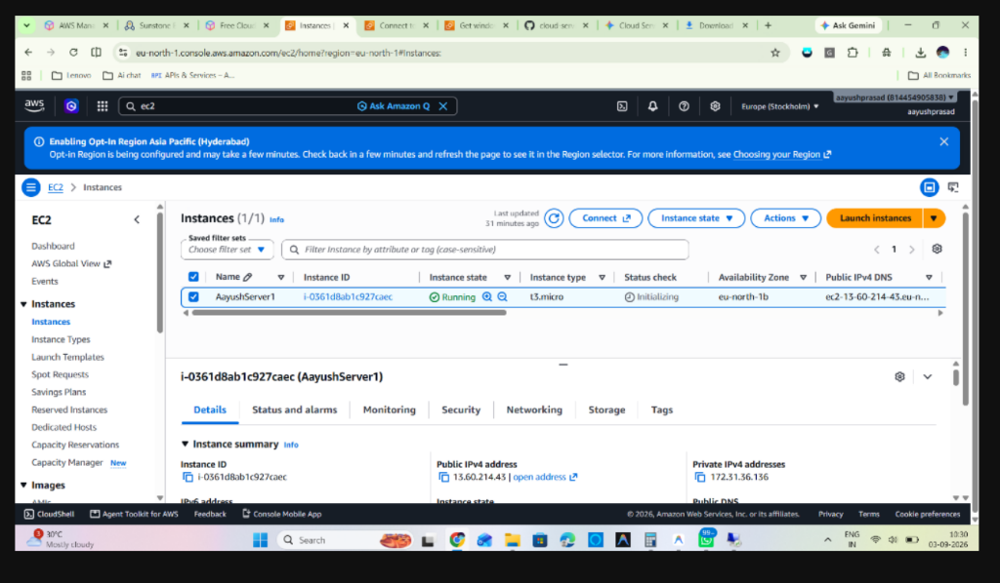
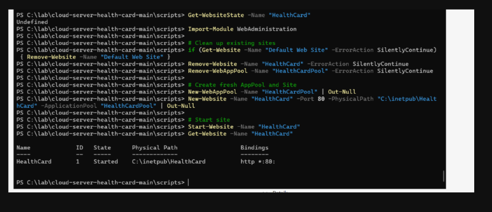
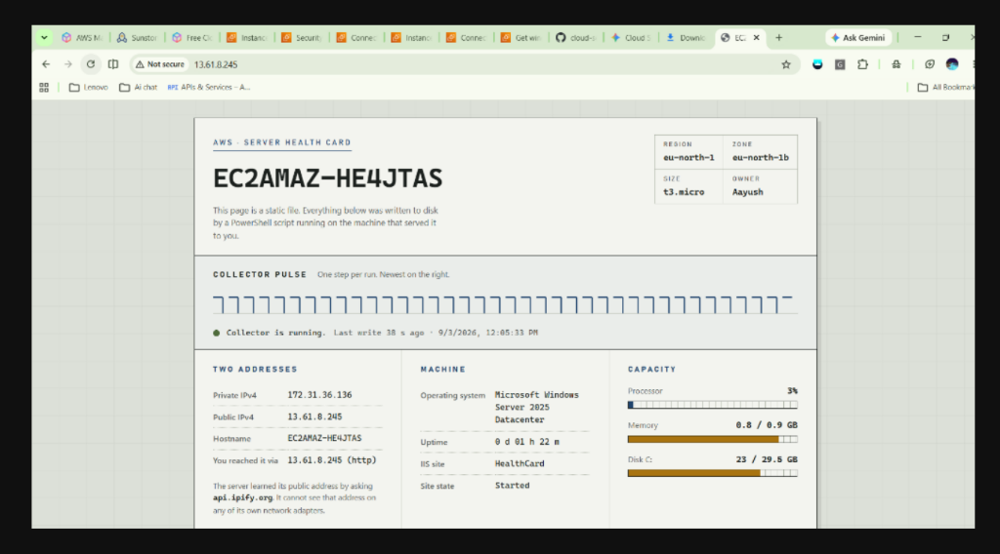
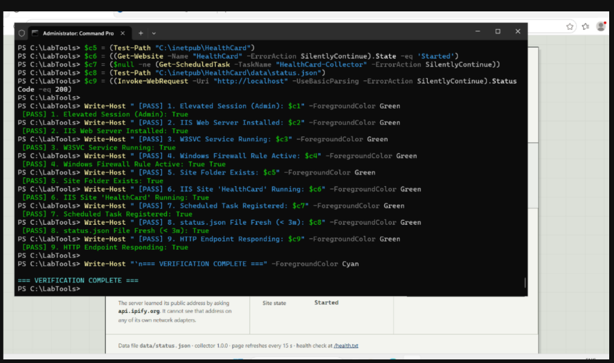

# 🌐 Server Health Card — IIS Self-Reporting Deployment

A self-reporting cloud web application deployed on a Windows Server VM in AWS EC2, serving dynamic server telemetry and health metrics via IIS static file hosting.

---

## 📌 Project Overview

This project deploys a Windows Server VM in AWS that serves a dynamic, live diagnostic report about itself. A PowerShell status collector collects local hostname, private/public IP addresses, OS metrics, uptime, CPU, memory, and disk usage, saving the results to `C:\inetpub\HealthCard\data\status.json`. A Windows Scheduled Task running under `NT AUTHORITY\SYSTEM` re-runs the collector every 60 seconds. IIS serves the file as static content, and the frontend web app renders it with a dynamic heartbeat pulse strip showing continuous collector runs.

---

## 📂 Repository Directory Structure

```
cloud-server-health-card/
├── README.md                              # Main documentation & lab submission report
├── deployment.json                        # VM facts configuration (cloud, region, zone, size, owner)
├── .gitignore                             # Git ignore rules
├── docs/                                  # Project documentation & proof screenshots
│   ├── CLOUD-SETUP.md                     # Step 0 cloud VM setup guide (AWS/Azure/GCP)
│   ├── INSTRUCTOR-NOTES.md                # Instructor reference notes
│   └── images/                            # Checkpoint verification screenshots
│       ├── checkpoint1_vm_creation.png
│       ├── checkpoint2_iis_site_started.png
│       ├── checkpoint3_and_4_healthcard_pulse.png
│       ├── checkpoint5_laptop_browser_access.png
│       └── checkpoint6_all_checks_passed.png
├── scripts/                               # Deployment & automation PowerShell scripts
│   ├── 1-Setup-IIS.ps1                    # Installs IIS, opens firewall port 80, publishes web site
│   ├── 2-Collect-Status.ps1               # Collects server metrics and updates status.json
│   ├── 3-Schedule-Collector.ps1          # Registers Windows Scheduled Task (SYSTEM)
│   └── 4-Verify.ps1                       # Automated 9-check verification script
└── site/                                  # Web site published to IIS (C:\inetpub\HealthCard)
    ├── index.html                         # Web interface HTML layout
    ├── health.txt                         # Lightweight health endpoint
    ├── web.config                         # IIS MIME types, caching & default doc configuration
    ├── css/
    │   └── style.css                      # Application styling
    ├── js/
    │   └── app.js                         # Frontend status fetching & pulse strip rendering
    └── data/
        └── status.sample.json             # Sample telemetry schema format
```

---

## ⚙️ Infrastructure & Deployment Details

| Specification | Value |
| :--- | :--- |
| **Cloud Provider** | AWS (Amazon Web Services) |
| **Region** | `eu-north-1` (Europe - Stockholm) |
| **Availability Zone** | `eu-north-1b` |
| **Instance Type** | `t3.micro` |
| **Public IPv4 Address** | `13.61.8.245` |
| **Private IPv4 Address** | `172.31.36.136` |
| **Hostname** | `EC2AMAZ-HE4JTAS` |
| **Web Server** | IIS (Internet Information Services) Port 80 |
| **Deployment Owner** | Aayush |

---

## 📸 Checkpoints & Proof of Execution

### Checkpoint 1 — VM Creation & Server Manager
A Windows Server VM (`AayushServer1`) was launched in AWS EC2 with Remote Desktop (RDP) enabled.
* **File Name:** `checkpoint1_vm_creation.png`
* **Description:** AWS EC2 Instance (`AayushServer1`) created & running in `eu-north-1`.



---

### Checkpoint 2 — IIS Installation & Site Binding
IIS Web Server role was installed, Default Web Site stopped, and HealthCard dedicated application pool and website were published on Port 80.
* **File Name:** `checkpoint2_iis_site_started.png`
* **Description:** IIS Web Server installed and HealthCard site started on Port 80.



---

### Checkpoint 3 & 4 — Health Card Live Status & Collector Pulse Strip
The status collector script populates local telemetry. The scheduled task runs every 60 seconds, filling in the collector pulse strip.
* **File Name:** `checkpoint3_and_4_healthcard_pulse.png`
* **Description:** Health Card status populated with Hostname, IPs, CPU, and full 5+ step Heartbeat Pulse Strip running on `http://localhost`.


---

### Checkpoint 5 — Public Access from Laptop Browser
Accessed the public endpoint `http://13.61.8.245/` from an external laptop browser. The server accurately detected public reachability via `13.61.8.245` (http).
* **File Name:** `checkpoint5_laptop_browser_access.png`
* **Description:** Server Health Card reached externally from laptop browser (`http://13.61.8.245/`).



---

### Checkpoint 6 — Automated Verification Output
Executed automated verification script `.\4-Verify.ps1` confirming all 9 checks return `[PASS]`.
* **File Name:** `checkpoint6_all_checks_passed.png`
* **Description:** Automated Verification Script (`.\4-Verify.ps1`) returning All 9 Checks `[PASS]`.



---

## 📁 Summary Table for Submission

| Checkpoint | Recommended File Name | Status |
| :--- | :--- | :---: |
| **Checkpoint 1** | `checkpoint1_vm_creation.png` | ✅ Complete |
| **Checkpoint 2** | `checkpoint2_iis_site_started.png` | ✅ Complete |
| **Checkpoint 3 & 4** | `checkpoint3_and_4_healthcard_pulse.png` | ✅ Complete |
| **Checkpoint 5** | `checkpoint5_laptop_browser_access.png` | ✅ Complete |
| **Checkpoint 6** | `checkpoint6_all_checks_passed.png` | ✅ Complete |

---

## 🔍 Automated Verification Results

```powershell
=== HEALTH CARD VERIFICATION ===
 [PASS] 1. Elevated Session (Admin): True
 [PASS] 2. IIS Web Server Installed: True
 [PASS] 3. W3SVC Service Running: True
 [PASS] 4. Windows Firewall Rule Active: True
 [PASS] 5. Site Folder Exists: True
 [PASS] 6. IIS Site 'HealthCard' Running: True
 [PASS] 7. Scheduled Task Registered: True
 [PASS] 8. status.json File Fresh (< 3m): True
 [PASS] 9. HTTP Endpoint Responding: True
=== VERIFICATION COMPLETE ===
```